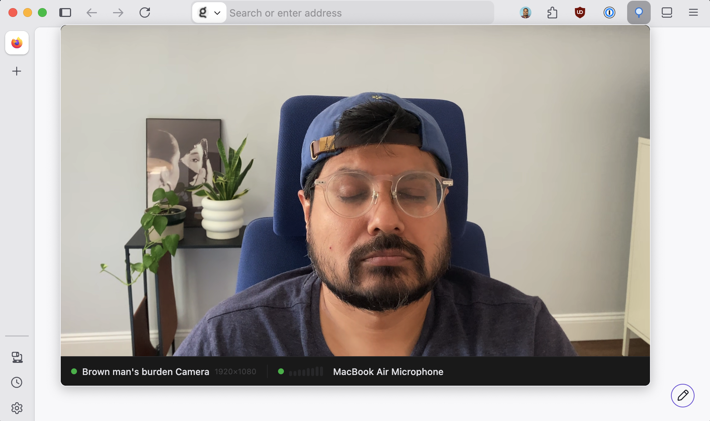

# Mirror

Instant webcam mirror with camera and mic status. Click the toolbar icon to open a live self-view with a status bar showing camera/mic state, device name, resolution, and an audio level meter.

Works as an unpacked extension in Chrome and Firefox.

## Load in Chrome

1. Go to `chrome://extensions`.
2. Enable **Developer mode** (top right).
3. Click **Load unpacked** and select this folder.
4. Click the Mirror icon in the toolbar.

Chrome popups can't show the camera/mic permission prompt directly — the first time, use the "Open in a tab" button so the prompt can appear, then grant access. After that, the popup works normally.

## Load in Firefox

**Temporary (any Firefox build):**

1. Go to `about:debugging#/runtime/this-firefox`.
2. Click **Load Temporary Add-on…** and select `manifest.json`.
3. Click the Mirror icon in the toolbar.

This is wiped on restart, so you'll reload it each session.

**Persistent unpacked (Developer Edition, Nightly, or ESR only):**

1. Go to `about:config` and set `xpinstall.signatures.required` to `false`.
2. Load it the same way as above via `about:debugging`.

Release Firefox enforces signing and won't allow persistent unpacked installs — for that you'd need to submit the extension to [addons.mozilla.org](https://addons.mozilla.org) for signing (can be unlisted/private) and install the signed `.xpi`.

As with Chrome, grant camera/mic access from a regular tab first if the popup can't show the permission prompt.

## Safari

Not currently supported — would require converting to a Safari Web Extension via Xcode and a different packaging/distribution flow.
